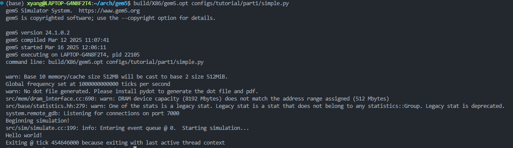

# 实验一：gem5模拟器

## 运行信息

### 编译信息

### simple 脚本运行

### two_level 脚本运行

## 流程简述

### 构建 gem5 过程简述

`gem5` 基于 gcc, scons, python 等工具，按照要求在 ubuntu 上配置好相应版本

`git clone` 仓库后，使用 `scons build/X86/gem5.opt -j7 CPU_MODELS=AtomicSimpleCPU,TimingSimpleCPU,O3CPU,MinorCPU` 命令生成 build 目录并完成 X86 系统仿真环境的编译

### 构建仿真脚本流程简述

1. 构建一个简单的 X86 仿真脚本
   1. 配置时钟周期与电平
   2. 添加单周期cpu，内存，总线
   3. 将各个部件相连并配置 X86 的中断控制与内存控制器
   4. 设置测试程序，创建线程并执行测试程序
2. 构建一个带有缓存的 X86 仿真脚本
   1. 添加 L1Cache，L2Cache 等部件类，并在其类中配置对应的连线方法
   2. 在主要仿真脚本中实例化 L1ICache, L1DCache, L2Cache 类，并将 L1Cache 与 cpu, l2Bus 相连；L2Cache 和内存总线相连
   3. 其余设置同 `simple.py` 脚本