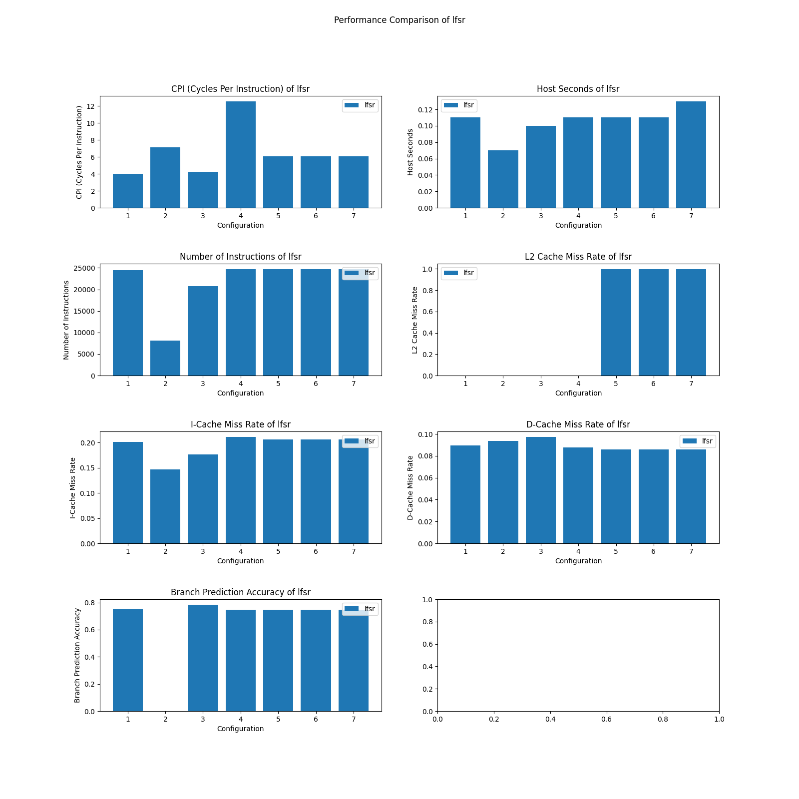
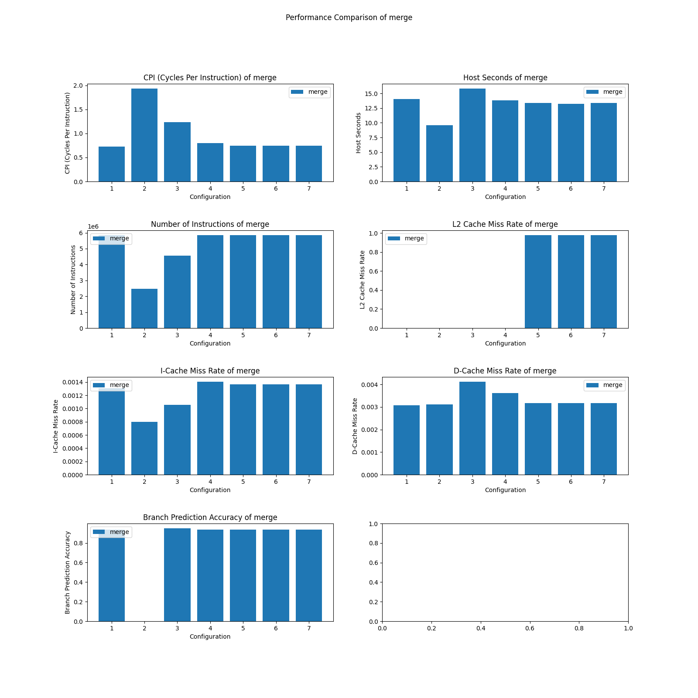
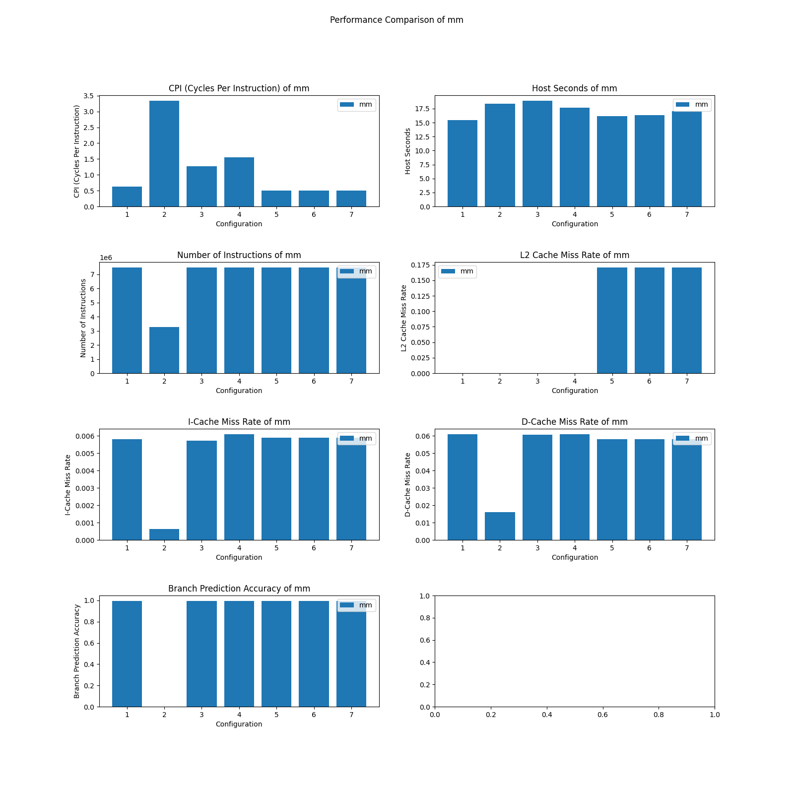
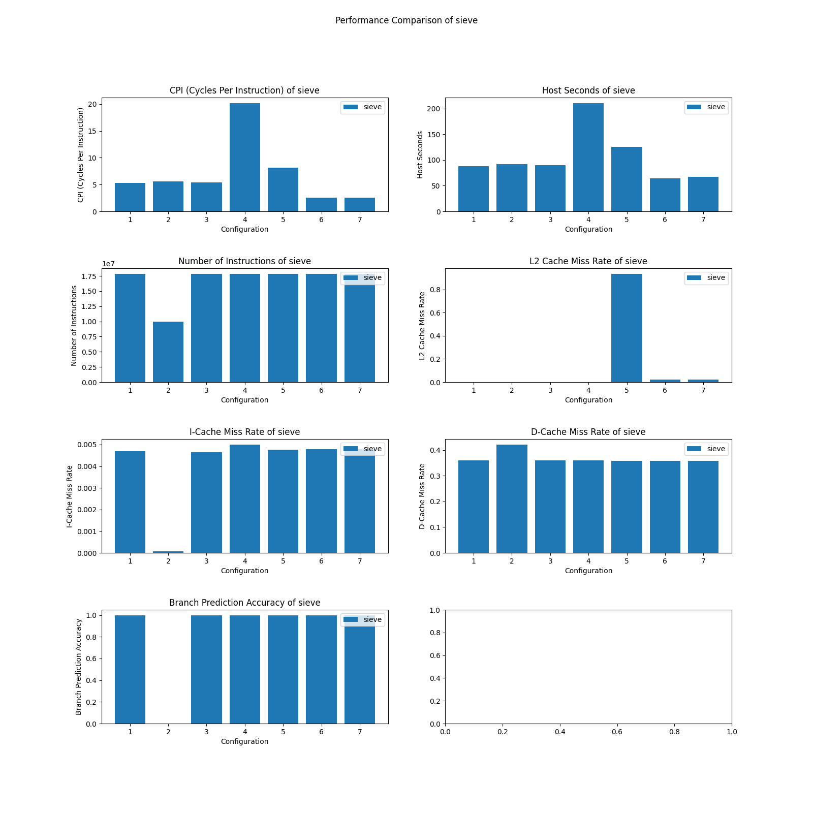
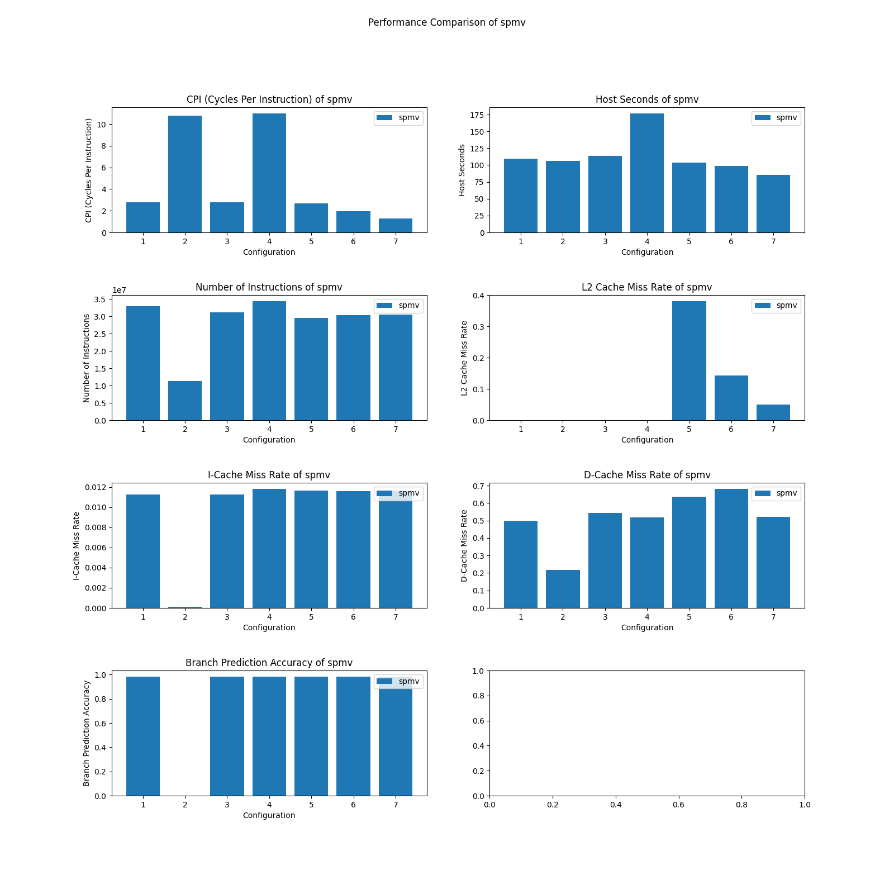

# lab2

各个配置情况

  -----
  
  | ID | CPU_type   | Issue width | CPU_clock | L2 cache |
  | -- | ---------- | ----------- | --------- | -------- |
  | 1  | DerivO3CPU | 8           | 1GHz      | No       |
  | 2  | MinorCPU   | -           | 1GHz      | No       |
  | 3  | DerivO3CPU | 2           | 1GHz      | No       |
  | 4  | DerivO3CPU | 8           | 4GHz      | No       |
  | 5  | DerivO3CPU | 8           | 1GHz      | 256kB    |
  | 6  | DerivO3CPU | 8           | 1GHz      | 2MB      |
  | 7  | DerivO3CPU | 8           | 1GHz      | 16MB     |
  
   ----


## 统计数据情况

1. **lsfr**:
    
2. **merge**:
    
3. **mm**:
    
4. **sieve**:
    
5. **spmv**:
    


## 统计数据分析

### 1. 比较性能的指标

1. **CPI**:
    CPI 反应了对应系统配置处理一条指令的周期耗费，反应 CPU 的执行效率，CPI 越小性能说明该系统处理一条指令的效率越高
2. **执行时间(hostSeconds)**:
    用户敏感的性能指标，综合反应了从编译到微架构的整体效率，直接衡量程序完成的快慢
3. **缓存命中率(missrate)**:
    分别考察 L1 的 icache 和 dcache，以及 L2 cache 的命中率，可以反映出访存的效率以及 cache 设计的合理性
4. **分支预测(branchPred)**:
    对于使用分支预测的架构，可以考察其分支预测准确率，衡量其流水线设计的性能
5. **指令数(numInsts)**: 
    反应对应 banchmark 在对应系统上实现所需要执行的指令数，反映了指令层次的优化

### 2. 是否值得采用乱序

从 CPI 方面考虑，同频率下，使用乱序发射的处理器显著的低于未使用乱序的架构。在这点上，乱序是有优势的；
但从 hostSeconds 即程序总的运行时间上，不同的 benchmark 上表现并不相同，考虑同频率的架构，未使用乱序的架构并不慢于使用了乱序架构的处理器，甚至在某些 benchmark 上还明显的优于使用了乱序的处理器。这可能是因为使用乱序后，需要更多的指令处理由于乱序发射带来的相关问题，这一点在指令数 number of instructions 上有所体现。

因此，如果仅从本次实验的 benchmark 上考虑，**如果更注重任务的响应时间，没有必要使用乱序；若更注重 CPI，可以使用乱序，但对于整体性能的影响在某些 benchmark 上并不显著**

### 3. 是否有基准测试受益于删除 L2 缓存

lfsr 和 merge 两个基准测试中，由于 L2cache 命中率较低，CPI 和 总的执行时间均表现出不亚于甚至优于使用了 L2cache 的架构

根据统计数据可知，这两个 benchmark 的 L2cache 命中率较低；
- 对于 `lstr` 程序，使用了 LFSR 的方式访问数据，这是一种伪随机的访问方式，会导致程序的空间局部性与时间局部性都较差，并且使用的数组 arr 的大小过大，对于较小的 L2cache 会导致频繁的替换，导致缓存命中率低，反而拖慢了程序的运行效率
- 对于 `merge` 程序，优于使用了归并的内存访问模式导致程序缺乏空间局部性，可能会导致频繁的缓存替换；在递归分割阶段，时间局部性也欠佳

### 4. 程序属性

1. `memory regularity`: 程序内存安排的规律性。当程序以一种可预测和规律的方式访问内存时，可以更好的利用缓存等硬件特性
2. `control regularity`: 程序控制逻辑的规律性。当程序控制流具有结构上的一致性和可预测性，则在分支预测等阶段可以以更高的概率命中，从而因跳转的指令带来的流水线停顿以及惩罚；另一方面也可以在编译阶段更好的进行代码优化，提高执行效率
3. `memory locality`: 存储局部性包含两方面
   1. 时间局部性：被访问过的数据项在未来短时间内更可能被再次访问
   2. 空间局部性：被访问过的数据项的相邻域上的数据更可能被再次访问
    具有局部性的程序更容易利用 cache 的特性进行优化，提高效率


### 5. 程序属性的统计指标

  -----
  
  | ID | stat-mark       | reason |
  | -- | ----------      | ------ |
  | a) memory regularity | system.cpu.dcache.overallMissRate::total | 数据缓存的命中率能较好的说明数据在内存中的排布是否具有较好的规律性    |
  | b) control regularity| branchPred                               | 分支预测的命中率可以反应程序控制流的可预测性，可预测性越好，规律性越好 |
  | c) memory locality   | system.l2.overallMissRate::total         | L2 缓存命中率从整体上反应了程序的局部性，包括时间局部性和空间局部性   |

  
   ----

### 6. benchmark 的程序属性

  -----
  
  | benchmark | memory regularity   | control regularity | memory locality |
  | --------- | ------------------- | ------------------ | --------------- |
  | **lfsr**      | 内存访问不规律，通过 lsfr 的伪随机性方式导致访问位置难以预测 | 控制流规律，只有简单循环并且次数固定 | 由于 lfsr 的形式访问数组导致时间和空间局部性都较差 |
  | **merge**     | 数据访问是线性的，内存访问较为规律 | 控制流主要有递归调用和循环控制，递归的深度由数组长度确定，是固定的；循环的执行次数取决于子数组大小，并不好确定，但循环简单，整体规律性较好 | 分割数组时可能导致内存访问的时间局部性和空间局部性较差，但在分割后的处理过程中由于数组的访问为线性的，具有一定的局部性 |
  | **mm**        | 对矩阵的访问主要时通过块矩阵形式，块内的规律性较好，但跨块时不连续 | 程序由多层嵌套循环控制，结构固定，循环逻辑较为简单，规律性较好 | 由于块矩阵乘法，整体上的时间局部性较好；m1 和 prod 的访问是线性的，具有较好的空间局部性，但 m2 的访问是通过列访问，可能会导致较差的空间局部性 |
  | **sieve**     | 在访问数组 notprime 的时候，存在以步长 p 的形式访问，但 p 是一个变量，导致访问模式并不一定规律 | 两层循环构成主要控制流，第二层循环中循环步长和分支均取决于 p ，循环条件简单且容易预测 | 第一层循环的局部性较好，但第二层循环中访问模式导致空间局部性较差 |
  | **spmv**      | 对于 val 和 cols 的访问中，索引是线性递增的，规律性较好，但是对于 vec 的访问中，访问模式取决于索引数组 cols 的值，而 cols 的值随机生成，导致访问规律性较差 | 控制流主要由两层循环构成，外层循环的次数固定，规律性较好，但内层循环根据稀疏矩阵 rowDelim ，规律性较差但严格递增 | 时间局部性：val 和 cols 中连续访问相邻的元素，具有较好的时间和空间局部性，但对于 vec 访问模式取决于 cols 时间局部性较差；空间局部性：vec 的空间局部性较差，rowDelim 的访问模式固定，局部性较好 |
  
   ----

**从统计数据的角度说明**：

1. **lfsr**: 可以看到 L2cache 和 L1dcache 的缓存命中率均较差，但分支预测成功率较高
2. **merge**: 与 lfsr 类似，cache 命中率较差，但分支预测的成功率较高
3. **mm**: L2cache 的命中率明显有所提升，分支预测成功率极高
4. **sieve**: 在小于 2MB 的 L2cache 容量下缓存命中率极低，而随着容量增大，命中率提高，但是 L1dache 的命中率仍然较低；分支预测成功率较高
5. **spmv**: L2cache 的命中率随着容量增大越来越高，主要是因为稀疏矩阵的原因；L1dcache 的缓存命中率较低

**各个程序的瓶颈**：

1. **lfsr**: 内存访问不规律，lfsr 的伪随机方式导致访问模式难以预测并且缺乏时间和空间局部性
2. **merge**: 递归调用分割数组导致空间局部性下降，缓存替换频繁
3. **mm**: 计算密集度高，若是可以同时进行多条运算指令显著提高 CPI 和效率
4. **sieve**: 缓存容量限制，小的缓存容量会面临空间局部性较差导致频繁的替换问题
5. **spmv**: 缓存容量限制，由于访问模式的稀疏也存在空间局部性较差的问题

### 7. mm 增强方法

**应用程序增强**：可以优化矩阵存储形式的布局，在程序中访问矩阵 `m2` 的时候是通过列序访问的，而数组在存储时是使用行优先存储的，一次会导致空间局部新较差；可以通过将矩阵 `m2` 转置成按行存储的形式，在后面列访问时实际上变为行访问，提升空间局部性，减少缓存miss

```c
float m2_transposed[N];
void transpose_m2() {
    for (int i = 0; i < row_size; ++i) {
        for (int j = 0; j < row_size; ++j) {
            m2_transposed[j * row_size + i] = m2[i * row_size + j];
        }
    }
}
```

转置过程中，对矩阵集中操作，局部性较好

**ISA增强**：基于 `X86` 的 `CISC` 理念，可以向其中添加 **FMA** 指令，即 (Fused Multiply-Add) 指令，将乘和加融合，便于矩阵运算，减少指令数和指令调度的开销，提高效率

**微体系结构增强**：增大缓存容量并优化缓存层次结构，若整个矩阵可以装在缓存里面可以避免频繁的缓存替换问题，提高效率；引入硬件预取和专用矩阵乘法的ALU单元，可以在硬件层次上实现加速，以及该矩阵乘法程序具有较好的规律性，通过好的硬件预取设计可以提高命中率，从而提高效率