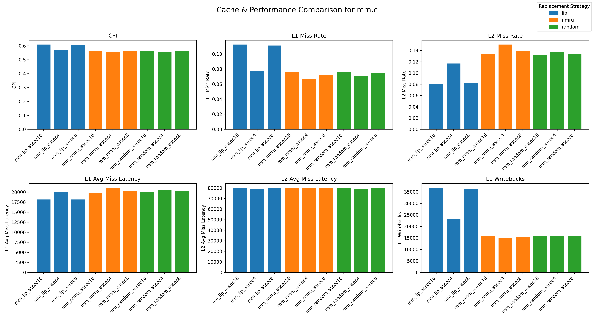

# 缓存的设计与优化

## 添加 NMRU

**代码逻辑**
```c++
 NMRU::getVictim(const ReplacementCandidates& candidates) const
 {
     // There must be at least one replacement candidate
     assert(candidates.size() > 0);
     // Visit all candidates to find victim
     ReplaceableEntry* mru = candidates[0];
     // find the most recently used entry
     for (const auto& candidate : candidates) {
         if (std::static_pointer_cast<NMRUReplData>(
                 candidate->replacementData)->lastTouchTick >
             std::static_pointer_cast<NMRUReplData>(
                 mru->replacementData)->lastTouchTick) {
             mru = candidate;
         }
     }
      // randomly get a victim from the candidates except the most recently used
      std::vector<ReplaceableEntry*> nmru_candidates;
      for (const auto& candidate : candidates) {
          if (candidate != mru) {
              nmru_candidates.push_back(candidate);
          }
      }
      if (nmru_candidates.empty()) {
          return mru;
      }
      ReplaceableEntry* victim = nmru_candidates[random_mt.random<unsigned>(0,
                                      nmru_candidates.size() - 1)];
     return victim;
 }
```
首先选出最近最多使用的块，然后在其他候选块中随机选择一个作为替换块。随机策略参考`random`
在`src/mem/cache/replacement_policies/ReplacementPolicies.py`, `src/mem/cache/replacement_policies/SConscript` 中添加 `NMRU`的注册逻辑
在`configs/common/CacheConfig.py`, `Options.py` 中添加 `se.py` 脚本使用不同替换策略的逻辑

## 设计基于乱序 O3CPU 处理器的 cache

### 实验设计

评价指标：
- **执行时间**（simSeconds）`simSeconds`, `system.cpu.numCycles`
- **CPI**（Cycles Per Instruction）`system.cpu.cpi`
- **L1D miss rate** `system.cpu.dcache.overallMissRate::total`, `system.cpu.dcache.WriteReq.missRate::total`
- **L2 miss rate** `system.l2.overallMissRate::total`
- **替换次数** `system.cpu.dcache.replacements`, `system.l2.replacements`
- **写回次数** `system.cpu.dcache.writebacks::total` l2 与 l1D 的写回次数是一致的，l2具有 writebackclean 是一种同步机制保证缓存一致性
- **平均未命中延迟** `system.cpu.dcache.overallAvgMissLatency::total`, `system.l2.overallAvgMissLatency::total`

实验配置与相应指标

| 配置名            | CPI     | L1D MissRate | L1D MissLatency | L1D Writeback | L1D WriteReq MissRate | L1D Repl | L2 MissRate | L2 MissLatency | L2 Repl |
|-------------------|---------|--------------|------------------|---------------|------------------------|----------|--------------|----------------|---------|
| **random_assoc4** | 0.5566  | 0.0706       | 20557.71         | 15698         | 0.00841                | 25933    | 0.1376       | 79389.61       | 0       |
| **random_assoc8** | 0.5604  | 0.0743       | 20221.76         | 15918         | 0.00473                | 26787    | 0.1335       | 80151.34       | 0       |
| **random_assoc16** | 0.5615  | 0.0762       | 19936.34         | 15887         | 0.00276                | 27185    | 0.1316       | 80318.58       | 0       |
| **nmru_assoc4** | 0.5551  | 0.0664       | 21129.78**         | 14857         | 0.00165                | 23554    | 0.1507       | 79751.52       | 0       |
| **nmru_assoc8** | 0.5598  | 0.0725       | 20300.34         | 15544         | 0.00135            | 25577    | 0.1394       | 79702.62       | 1       |
| **nmru_assoc16** | 0.5618  | 0.0759       | 19881.27         | 15856         | 0.00129                | 26681    | 0.1340       | 79588.66       | 2       |
| **lip_assoc4** | 0.5670  | 0.0776       | 20051.09         | 23002         | 0.02779                | 30770    | 0.1170       | 79117.68       | 0       |
| **lip_assoc8** | 0.6083  | 0.1112       | 18159.50         | 36385         | 0.02957                | 44289    | 0.0824       | 80008.22       | 0       |
| **lip_assoc16** | 0.6092  | 0.1125       | 18163.86         | 36834         | 0.03120                | 45008    | 0.0812       | 79572.09       | 0       |


**可视化其中六个关键指标**



### 结果分析


| 指标名               | 含义说明 |
|----------------------|----------|
| **CPI**              | 每条指令平均时钟周期数，越低代表性能越好 |
| **L1D Miss Rate**    | 一级数据缓存未命中率，越低越好 |
| **L1D Miss Latency** | L1 未命中后的平均访问延迟，越低越好 |
| **L1D Writeback**    | 写回主存的次数，间接反映写压力 |
| **L1D WriteReq MissRate** | L1 写请求的未命中率，影响写回性能 |
| **L1D Repl**         | L1 缓存替换次数，替换多意味着缓存压力大 |
| **L2 Miss Rate**     | L2 缓存未命中率，越低越好 |
| **L2 Miss Latency**  | L2 未命中延迟，影响整体内存访问速度 |
| **L2 Repl**          | L2 替换次数，可视作 L2 的压力指标 |

---

**CPI（性能关键指标）**

| 策略     | assoc4 | assoc8 | assoc16 |
|----------|--------|--------|---------|
| random   | 0.5566 | 0.5604 | 0.5615 |
| **nmru** | **0.5551** | 0.5598 | 0.5618 |
| lip      | 0.5670 | 0.6083 | 0.6092 |

- **nmru_assoc4 拥有最低 CPI（0.5551）**
- 随着相联度提升，**CPI略升高**（对 `random` 和 `nmru` 都如此）
- `lip` 策略整体性能不佳（CPI 均较高）

**L1D Miss Rate 与 Repl**

| 配置        | MissRate | Repl |
|-------------|----------|------|
| nmru_assoc4 | **0.0664** | **23554** |
| random_assoc4 | 0.0706 | 25933 |
| lip_assoc4    | 0.0776 | 30770 |

- **nmru_assoc4 在 Miss Rate 和 Repl 都优于其他**
- `lip` 替换次数最多，说明 `victim block` 选择不理想，替换策略保留了不常用的数据

**L1D Writeback & Write Miss Rate**

| 配置         | Writeback | Write MissRate |
|--------------|-----------|----------------|
| nmru_assoc4  | **14857**     | **0.00165**         |
| random_assoc4 | 15698     | 0.00841         |
| lip_assoc4    | 23002     | 0.02779         |

- **nmru_assoc4 的写请求更命中（MissRate 最小）**，写回压力也最小
- `lip` 写请求大量未命中，说明数据重用性差或缓存替换不合理

**L2 层表现**

| 配置         | L2 MissRate | L2 Latency | L2 Repl |
|--------------|-------------|------------|---------|
| nmru_assoc4  | 0.1507      | 79751.52   | 0       |
| random_assoc4| 0.1376      | 79389.61   | 0       |
| lip_assoc16  | **0.0812**      | 79572.09   | 0       |

- **L2 MissRate 最低的是 lip_assoc16**，说明提升 L1 相联度 + lip 策略对 L2 缓存有缓解作用
- 但因为 `lip` 的 L1D 表现太差（高 MissRate），**总 CPI 反而最差**

---

**最佳性能配置：`mm_nmru_assoc4`**

- CPI 最低（0.5551）
- L1D MissRate 最低（0.0664）
- 写请求 MissRate 最低（0.00165）
- L1 替换次数最少（23554）
- 虽然 L2 MissRate 稍高（0.1507），但总体影响较小

**原因分析**

1. **NMru 策略对 L1 替换更保守合理**：
   - NMRU (Not Most Recently Used) 优先替换“不是最近使用的块”，避免破坏热点数据
   - 对 `mm.c` 这种有一定数据局部性的程序特别有效
2. **4 路相联度刚好满足工作集大小**：
   - 提升到 8/16 路反而增加了访问时间（CPI略升），可能是访问延迟增大导致 marginal gain 减弱
3. **LIP性能较差**：
   - LIP 策略在数据局部性较强的情况下表现不佳，可能是因为它过于激进地替换数据块
   - 适合数据访问模式不规律的场景，但对于本实验中矩阵乘法这种局部性强的场景，NMru 更合适

### 实际情况分析

| 策略     | L1 Miss Rate（实验中数据） | L1 Tag Latency（周期） | 分析   |
|----------|-------------------------------|-------------------------|--------|
| Random   | 0.0706                | 1 cycle                 | 延迟最低，但 miss 稍高 |
| NMRU     | 0.0664                | 2 cycles                | miss 最低，延迟适中 |
| LIP      | 0.0776                | 2 cycles                | miss 高，延迟也不占优 |

- **Random**：更快的访问，性能依赖于 miss rate 
- **NMRU**：miss rate 优秀，延迟尚可，综合性能较高
- **LIP**：miss 多且 tag 访问慢，性能双输

综合来看，**NMRU 策略在本实验中表现最佳**，适合数据局部性强的场景。虽然 LIP 在某些情况下可能有优势，但在本实验中并不适用。

## cache 一致性实验

使用命令
```bash
build/X86/gem5.debug --debug-file=cache_trace.txt --debug-flags=Cache,CacheRepl configs/example/se.py --cpu-type=O3CPU --cpu-clock=2GHz --cmd=/home/xyang/arch/lab3/demo --caches --l2cache --l1d_size=1kB --l1i_size=1kB --l1d_assoc=4 --l1i_assoc=4 --l2_size=128kB --l2_assoc=4 --replace=lru '--param=system.cpu[0].issueWidth=8' --num-cpus=4
```

### MOESI 协议

MOESI 协议是一种 **多处理器系统中用于缓存一致性（Cache Coherence）的协议**，是对传统 MESI 协议的扩展，在共享缓存系统中十分关键。它的名称来源于五个缓存块的可能状态首字母：

- **M（Modified）**  
- **O（Owned）**  
- **E（Exclusive）**  
- **S（Shared）**  
- **I（Invalid）**

MOESI 协议能更有效地在多个 CPU 核心或处理器之间维护缓存的一致性，特别适用于支持**写回（write-back）缓存**的系统。

**状态详解**

| 状态 | 含义 | 缓存块唯一性 | 内存内容是否一致 | 能否读 | 能否写 | 是否需要写回 |
|------|----------|---------------|------------------|--------|--------|---------------|
| M    | 已修改   | 是（只有我有）| 否（已被修改）   | 能    | 能    | 是（被替换时）|
| O    | 拥有者   | 否（别人也有）| 否（已被修改）| 能 | 能   | 是（负责写回）|
| E    | 独占     | 是（只有我有）| 是（未被修改）   | 能    | 能     | 否（未被修改）|
| S    | 共享     | 否（多人共享）| 是               | 能    | 否     | 否    |
| I    | 无效     | -             | -                | 否    | 否     | 否      |

---

使用的脚本辅助命令为：
```bash
grep "access for WriteReq" cache_trace.txt | grep "state: .* (S)" | head -n 10 # 查看 S 状态的写请求
grep "access for WriteReq" cache_trace.txt | grep "state: .* (O)" | head -n 10 # 查看 O 状态的写请求

grep "handleSnoop: snoop hit for ReadSharedReq" cache_trace.txt | grep "old state is state: .* (M)" | head -n 10  # 查看 M 状态的读请求
grep "handleSnoop: snoop hit for ReadSharedReq" cache_trace.txt | grep "old state is state: .* (O)" | head -n 10  # 查看 O 状态的读请求
grep "handleSnoop: snoop hit for ReadSharedReq" cache_trace.txt | grep "old state is state: .* (E)" | head -n 10  # 查看 E 状态的读请求
grep "handleSnoop: snoop hit for ReadSharedReq" cache_trace.txt | grep "old state is state: .* (S)" | head -n 10  # 查看 S 状态的读请求

grep "handleSnoop: snoop hit for ReadExReq" cache_trace.txt | grep "old state is state: .* (S)" | head -n 10   # 查看 S 状态的独占请求
grep "handleSnoop: snoop hit for ReadExReq" cache_trace.txt | grep "old state is state: .* (M)" | head -n 10   # 查看 M 状态的独占请求
grep "handleSnoop: snoop hit for ReadExReq" cache_trace.txt | grep "old state is state: .* (O)" | head -n 10   # 查看 O 状态的独占请求
grep "handleSnoop: snoop hit for ReadExReq" cache_trace.txt | grep "old state is state: .* (E)" | head -n 10   # 查看 E 状态的独占请求 trace中没有

grep "Replacement victim: state: .* (E)" cache_trace.txt | head -n 10   # 寻找替换块为 E 的请求
grep "Replacement victim: state: .* (O)" cache_trace.txt | head -n 10   # 寻找替换块为 O 的请求
grep "Replacement victim: state: .* (S)" cache_trace.txt | head -n 10   # 寻找替换块为 S 的请求 前10个中无法找到写缺失情况

```


| 序号 | 请求类型 | 请求源 | 缓存块状态（MOESI） | 功能与解释 |
| -- | -------- | ------ | ------------------ | ---------- |
| 1. | 读命中   | 处理器 | S / O / E / M      | **直接读，状态无需改变** <br>  787500: system.cpu0.dcache: access for ReadReq [31ea8:31eaf] hit state: 20202026 (E) writable: 1 readable: 1 dirty: 0 prefetched: 0 \| tag: 0xc7 secure: 0 valid: 1 \| set: 0xa way: 0 <br>  787500: system.cpu0.dcache: access for ReadReq [32a48:32a4f] hit state: 2020202e (M) writable: 1 readable: 1 dirty: 1 prefetched: 0 \| tag: 0xca secure: 0 valid: 1 \| set: 0x9 way: 0         |
| 2. | 读缺失   | 处理器 | I                  | **向总线提交读共享请求，在替换块为(I)时直接替换，根据总线信号状态转为(E)或(S)** <br>  260500: system.cpu0.dcache: access for ReadReq [32000:32007] miss <br>  261501: system.cpu0.dcache: createMissPacket: created ReadSharedReq [32000:3203f] from ReadReq [32000:32007] <br>  351500: system.cpu0.dcache: Replacement victim: state: 72000000 (I) writable: 0 readable: 0 dirty: 0 prefetched: 0 \| tag: 0xffffffffffffffff secure: 0 valid: 0 \| set: 0 way: 0 <br>  351500: system.cpu0.dcache: Block addr 0x32000 (ns) moving from  to state: 72000006 (E) writable: 1 readable: 1 dirty: 0 prefetched: 0 \| tag: 0xc8 secure: 0 valid: 1 \| set: 0 way: 0 <br> 221445000: system.cpu0.dcache: createMissPacket: created UpgradeReq [34e40:34e7f] from WriteReq [34e48:34e4f]     |
| 3. | 读缺失   | 处理器 | S                  | **向总线提交读共享请求，在替换块为(S)时直接替换，向总线报告替换块为干净块不用更新，替换进来的块根据总线响应信号转为(M)** <br> 220820000: system.cpu0.dcache: access for ReadReq [51a58:51a5f] miss <br> 220821000: system.cpu0.dcache: createMissPacket: created ReadSharedReq [51a40:51a7f] from ReadReq [51a58:51a5f] <br> 220832000: system.cpu0.dcache: Replacement victim: state: 20202024 (S) writable: 0 readable: 1 dirty: 0 prefetched: 0 \| tag: 0xd3 secure: 0 valid: 1 \| set: 0x9 way: 0 <br> 220832000: system.cpu0.dcache: Create CleanEvict CleanEvict [34e40:34e7f] <br> 220832000: system.cpu0.dcache: Block addr 0x51a40 (ns) moving from  to state: 2020202e (M) writable: 1 readable: 1 dirty: 1 prefetched: 0 \| tag: 0x146 secure: 0 valid: 1 \| set: 0x9 way: 0 <br> 220833000: system.cpu0.dcache: sendWriteQueuePacket: write CleanEvict [34e40:34e7f]      |
| 4. | 读缺失   | 处理器 | O                  | **向总线提交读共享请求，在替换块为(O)时，提交写回请求** <br> 332190500: system.cpu1.dcache: access for ReadReq [3e1d0:3e1d7] miss <br>332192501: system.cpu1.dcache: sendMSHRQueuePacket: MSHR ReadReq [3e1d0:3e1d7] <br>332192501: system.cpu1.dcache: createMissPacket: created ReadSharedReq [3e1c0:3e1ff] from ReadReq [3e1d0:3e1d7] <br>332205500: system.cpu1.dcache: Block for addr 0x3e1c0 being updated in Cache <br>332205500: system.cpu1.dcache: Replacement victim: state: c (O) writable: 0 readable: 1 dirty: 1 prefetched: 0 \| tag: 0xfc secure: 0 valid: 1 \| set: 0x7 way: 0 <br>332205500: system.cpu1.dcache: Create Writeback WritebackDirty [3f1c0:3f1ff] writable: 0, dirty: 1           |
| 5. | 读缺失   | 处理器 | M                  | **先向总线提交读共享请求，在替换块为(M)时向总线提交写回请求，写回后,根据总线信号将替换后的块状态转为(E)或(S)** <br> 260500: system.cpu0.dcache: access for ReadReq [31e68:31e6f] miss <br>  261500: system.cpu0.dcache: createMissPacket: created ReadSharedReq [31e40:31e7f] from ReadReq [31e68:31e6f] <br> 345500: system.cpu0.dcache: Replacement victim: state: 2020202e (M) writable: 1 readable: 1 dirty: 1 prefetched: 0 \| tag: 0xd3 secure: 0 valid: 1 \| set: 0x9 way: 0 <br> 345500: system.cpu0.dcache: Create Writeback WritebackDirty [34e40:34e7f] writable: 1, dirty: 1 <br> 345500: system.cpu0.dcache: Block addr 0x31e40 (ns) moving from  to state: 20202026 (E) writable: 1 readable: 1 dirty: 0 prefetched: 0 \| tag: 0xc7 secure: 0 valid: 1 \| set: 0x9 way: 0            |
| 6. | 读缺失   | 处理器 | E                  | **向总线提交读共享请求，在替换块为(E)时直接替换，向总线报告已经将该块替换，根据总线信号将替换后的块状态转为(E)或(S)** <br>  461000: system.cpu0.dcache: access for ReadReq [32a50:32a57] miss <br> 461000: system.cpu0.dcache: handleTimingReqMiss coalescing MSHR for ReadReq [32a50:32a57] <br> 461500: system.cpu0.dcache: sendMSHRQueuePacket: MSHR ReadReq [32a40:32a47] <br> 461500: system.cpu0.dcache: createMissPacket: created ReadSharedReq [32a40:32a7f] from ReadReq [32a40:32a47] <br> 537500: system.cpu0.dcache: recvTimingResp: Handling response ReadResp [32a40:32a7f] <br> 537500: system.cpu0.dcache: Block for addr 0x32a40 being updated in Cache <br> 537500: system.cpu0.dcache: Replacement victim: state: 20202026 (E) writable: 1 readable: 1 dirty: 0 prefetched: 0 \| tag: 0xc7 secure: 0 valid: 1 \| set: 0x9 way: 0 <br> 537500: system.cpu0.dcache: Create CleanEvict CleanEvict [31e40:31e7f] <br> 537500: system.cpu0.dcache: Block addr 0x32a40 (ns) moving from  to state: 20202026 (E) writable: 1 readable: 1 dirty: 0 prefetched: 0 \| tag: 0xca secure: 0 valid: 1 \| set: 0x9 way: 0 <br> 538500: system.cpu0.dcache: sendWriteQueuePacket: write CleanEvict [31e40:31e7f]          |
| 7. | 写命中   | 处理器 | E                  | **写入后将状态转为(M)** <br> 180500: system.cpu0.dcache: access for WriteReq [34e40:34e47] hit state: 2020202e (M) writable: 1 readable: 1 dirty: 1 prefetched: 0 \| tag: 0xd3 secure: 0 valid: 1 \| set: 0x9 way: 0           |
| 8. | 写命中   | 处理器 | S                  | **向总线发出upgrade广播，使其他同样持有的缓存中缓存块失效，根据总线信号将替换后的块状态转为(E)或(O)** <br> 221444000: system.cpu0.dcache: access for WriteReq [34e48:34e4f] hit state: 20202024 (S) writable: 0 readable: 1 dirty: 0 prefetched: 0 \| tag: 0xd3 secure: 0 valid: 1 \| set: 0x9 way: 0 <br> 221457000: system.cpu0.dcache: Block addr 0x34e40 (ns) moving from state: 20202020 (S) writable: 0 readable: 0 dirty: 0 prefetched: 0 \| tag: 0xd3 secure: 0 valid: 1 \| set: 0x9 way: 0 to state: 2020202e (M) writable: 1 readable: 1 dirty: 1 prefetched: 0 \| tag: 0xd3 secure: 0 valid: 1 \| set: 0x9 way: 0        |
| 9. | 写命中   | 处理器 | O                  | **向总线发出upgrade广播，使其他同样持有的缓存中对应块失效，本身状态不变 <br>** 336968500: system.cpu1.dcache: access for WriteReq [4024:4027] hit state: c (O) writable: 0 readable: 1 dirty: 1 prefetched: 0 \| tag: 0x10 secure: 0 valid: 1 \| set: 0 way: 0 <br> 336969500: system.cpu1.dcache: createMissPacket: created UpgradeReq [4000:403f] from WriteReq [4024:4027]         |
| 10. | 写命中   | 处理器 | M                  | **直接写入，状态不变** <br> 912500: system.cpu0.dcache: access for WriteReq [32a40:32a47] hit state: 2020202e (M) writable: 1 readable: 1 dirty: 1 prefetched: 0 \| tag: 0xca secure: 0 valid: 1 \| set: 0x9 way: 0           |
| 11. | 写缺失   | 处理器 | I                  | **先向总线创建读独占请求，在替换块为(I)时将替换进来的块状态转为(E)然后进行写命中操作** <br>   94000: system.cpu0.dcache: access for WriteReq [34e48:34e4f] miss <br>    95000: system.cpu0.dcache: createMissPacket: created ReadExReq [34e40:34e7f] from WriteReq [34e48:34e4f] <br>  179500: system.cpu0.dcache: Replacement victim: state: 20202020 (I) writable: 0 readable: 0 dirty: 0 prefetched: 0 \| tag: 0xffffffffffffffff secure: 0 valid: 0 \| set: 0x9 way: 0 <br>  179500: system.cpu0.dcache: Block addr 0x34e40 (ns) moving from  to state: 20202026 (E) writable: 1 readable: 1 dirty: 0 prefetched: 0 \| tag: 0xd3 secure: 0 valid: 1 \| set: 0x9 way: 0          |
| 12. | 写缺失   | 处理器 | S                  | **向总线创建独占请求，在替换块为(S)时向总线报告替换干净块，根据总线信号将新替换进入的块转为状态(E)** <br> 335242500: system.cpu0.dcache: recvTimingResp: Handling response ReadExResp [b9d80:b9dbf] <br> 335242500: system.cpu0.dcache: Block for addr 0xb9d80 being updated in Cache <br> 335242500: system.cpu0.dcache: Replacement victim: state: 7c147414 (S) writable: 0 readable: 1 dirty: 0 prefetched: 0 \| tag: 0xfc secure: 0 valid: 1 \| set: 0x6 way: 0 <br> 335242500: system.cpu0.dcache: Create CleanEvict CleanEvict [3f180:3f1bf] <br> 335242500: system.cpu0.dcache: Block addr 0xb9d80 (ns) moving from  to state: 7c147416 (E) writable: 1 readable: 1 dirty: 0 prefetched: 0 \| tag: 0x2e7 secure: 0 valid: 1 \| set: 0x6 way: 0          |
| 13. | 写缺失   | 处理器 | O                  | **向总线创建独占请求，在替换块为(O)时向总线提交写回请求，替换进来的块根据总线相应信号状态转为(E)** <br> 334143500: system.cpu0.dcache: createMissPacket: created ReadExReq [b2a00:b2a3f] from WriteReq [b2a0c:b2a0f] <br> 334219500: system.cpu0.dcache: recvTimingResp: Handling response ReadExResp [b2a00:b2a3f] <br> 334219500: system.cpu0.dcache: Block for addr 0xb2a00 being updated in Cache <br> 334219500: system.cpu0.dcache: Replacement victim: state: 2e31202c (O) writable: 0 readable: 1 dirty: 1 prefetched: 0 \| tag: 0xc5 secure: 0 valid: 1 \| set: 0x8 way: 0 <br> 334219500: system.cpu0.dcache: Create Writeback WritebackDirty [31600:3163f] writable: 0, dirty: 1 <br> 334219500: system.cpu0.dcache: Block addr 0xb2a00 (ns) moving from  to state: 2e312026 (E) writable: 1 readable: 1 dirty: 0 prefetched: 0 \| tag: 0x2ca secure: 0 valid: 1 \| set: 0x8 way: 0          |
| 14. | 写缺失   | 处理器 | M                  | **先向总线创建读独占请求，在请求块为(M)时向总线提交写回请求，然后将替换进来的块状态转为(E)** <br>  357500: system.cpu0.dcache: access for WriteReq [329f8:329ff] miss <br>  358500: system.cpu0.dcache: createMissPacket: created ReadExReq [329c0:329ff] from WriteReq [329f8:329ff] <br>  428500: system.cpu0.dcache: Replacement victim: state: 616e206e (M) writable: 1 readable: 1 dirty: 1 prefetched: 0 \| tag: 0xc5 secure: 0 valid: 1 \| set: 0x7 way: 0 <br>  428500: system.cpu0.dcache: Create Writeback WritebackDirty [315c0:315ff] writable: 1, dirty: 1 <br>  428500: system.cpu0.dcache: Block addr 0x329c0 (ns) moving from  to state: 616e2066 (E) writable: 1 readable: 1 dirty: 0 prefetched: 0 \| tag: 0xca secure: 0 valid: 1 \| set: 0x7 way: 0     |
| 15. | 写缺失   | 处理器 | E                  | **先向总线创建读独占请求，在替换块为(E)时向总线报告清楚干净块，然后将替换进来的块状态转为(E)** <br> 430500: system.cpu0.dcache: access for WriteReq [32a98:32a9f] miss <br>  431500: system.cpu0.dcache: createMissPacket: created ReadExReq [32a80:32abf] from WriteReq [32a98:32a9f] <br>  501500: system.cpu0.dcache: Replacement victim: state: 20202026 (E) writable: 1 readable: 1 dirty: 0 prefetched: 0 \| tag: 0xc7 secure: 0 valid: 1 \| set: 0xa way: 0 <br>  501500: system.cpu0.dcache: Create CleanEvict CleanEvict [31e80:31ebf] <br>  501500: system.cpu0.dcache: Block addr 0x32a80 (ns) moving from  to state: 20202026 (E) writable: 1 readable: 1 dirty: 0 prefetched: 0 \| tag: 0xca secure: 0 valid: 1 \| set: 0xa way: 0   |
| 16. | 读缺失   | 总线   | S                  | **向总线接收到其他缓存读缺失请求，状态不变，将数据共享** <br> 337443500: system.cpu3.dcache: sendMSHRQueuePacket: MSHR ReadReq [3f140:3f147] <br> 337443500: system.cpu3.dcache: createMissPacket: created ReadSharedReq [3f140:3f17f] from ReadReq [3f140:3f147] <br> 337443500: system.cpu1.dcache: handleSnoop: snoop hit for ReadSharedReq [3f140:3f17f], old state is state: 4 (S) writable: 0 readable: 1 dirty: 0 prefetched: 0 \| tag: 0xfc secure: 0 valid: 1 \| set: 0x5 way: 0 <br> 337443500: system.cpu1.dcache: new state is state: 4 (S) writable: 0 readable: 1 dirty: 0 prefetched: 0 \| tag: 0xfc secure: 0 valid: 1 \| set: 0x5 way: 0          |
| 17. | 读缺失   | 总线   | O                  | **从总线收到其他缓存读缺失请求，状态不变，将数据共享** <br> 332811000: system.cpu1.dcache: createMissPacket: created ReadSharedReq [31600:3163f] from ReadReq [31620:31620] <br> 332811000: system.cpu0.dcache: handleSnoop: snoop hit for ReadSharedReq [31600:3163f], old state is state: 2e31202c (O) writable: 0 readable: 1 dirty: 1 prefetched: 0 \| tag: 0xc5 secure: 0 valid: 1 \| set: 0x8 way: 0 <br> 332811000: system.cpu0.dcache: new state is state: 2e31202c (O) writable: 0 readable: 1 dirty: 1 prefetched: 0 \| tag: 0xc5 secure: 0 valid: 1 \| set: 0x8 way: 0           |
| 18. | 读缺失   | 总线   | M                  | **从总线收到其他缓存读缺失请求，将状态(M)转为(O)，将数据共享出去** <br> 331385000: system.cpu1.dcache: sendMSHRQueuePacket: MSHR ReadReq [acfb0:acfb7] <br> 331385000: system.cpu1.dcache: createMissPacket: created ReadSharedReq [acf80:acfbf] from ReadReq [acfb0:acfb7] <br> 331385000: system.cpu0.dcache: handleSnoop: snoop hit for ReadSharedReq [acf80:acfbf], old state is state: 206e692e (M) writable: 1 readable: 1 dirty: 1 prefetched: 0 \| tag: 0x2b3 secure: 0 valid: 1 \| set: 0xe way: 0 <br> 331385000: system.cpu0.dcache: new state is state: 206e692c (O) writable: 0 readable: 1 dirty: 1 prefetched: 0 \| tag: 0x2b3 secure: 0 valid: 1 \| set: 0xe way: 0          |
| 19. | 读缺失   | 总线   | E                  | **从总线收到其他缓存读缺失请求，将状态(E)转为(S)，将数据共享** <br> 335548000: system.cpu2.dcache: sendMSHRQueuePacket: MSHR ReadReq [75475:75475] <br> 335548000: system.cpu2.dcache: createMissPacket: created ReadSharedReq [75440:7547f] from ReadReq [75475:75475] <br> 335548000: system.cpu1.dcache: handleSnoop: snoop hit for ReadSharedReq [75440:7547f], old state is state: 6 (E) writable: 1 readable: 1 dirty: 0 prefetched: 0 \| tag: 0x1d5 secure: 0 valid: 1 \| set: 0x1 way: 0 <br> 335548000: system.cpu1.dcache: new state is state: 4 (S) writable: 0 readable: 1 dirty: 0 prefetched: 0 \| tag: 0x1d5 secure: 0 valid: 1 \| set: 0x1 way: 0           |
| 20. | 无效     | 总线   | -                  | **收到总线的upgrade信号，将状态转为无效(I)** <br> 336969500: system.cpu2.dcache: handleSnoop: snoop hit for UpgradeReq [4000:403f], old state is state: 4 (S) writable: 0 readable: 1 dirty: 0 prefetched: 0 \| tag: 0x10 secure: 0 valid: 1 \| set: 0 way: 0 <br> 336969500: system.cpu2.dcache: new state is state: 0 (I) writable: 0 readable: 0 dirty: 0 prefetched: 0 \| tag: 0xffffffffffffffff secure: 0 valid: 0 \| set: 0 way: 0           |
| 21. | 写缺失   | 总线   | S                  | **收到总线中独占请求，交还数据，状态从(S)转为无效(I)** <br> 333858000: system.cpu1.dcache: access for WriteReq [3f1f8:3f1ff] miss <br> 33859000: system.cpu1.dcache: sendMSHRQueuePacket: MSHR WriteReq [3f1f8:3f1ff] <br> 333859000: system.cpu1.dcache: createMissPacket: created ReadExReq [3f1c0:3f1ff] from WriteReq [3f1f8:3f1ff] <br> 333859000: system.cpu0.dcache: handleSnoop: snoop hit for ReadExReq [3f1c0:3f1ff], old state is state: 616e2064 (S) writable: 0 readable: 1 dirty: 0 prefetched: 0 \| tag: 0xfc secure: 0 valid: 1 \| set: 0x7 way: 0 <br> 333859000: system.cpu0.dcache: new state is state: 616e2060 (I) writable: 0 readable: 0 dirty: 0 prefetched: 0 \| tag: 0xffffffffffffffff secure: 0 valid: 0 \| set: 0x7 way: 0           |
| 22. | 写缺失   | 总线   | M                  | **收到总线中独占请求，交还数据，状态转为无效(I)** <br> 334704000: system.cpu2.dcache: sendMSHRQueuePacket: MSHR WriteReq [b2698:b269f] <br> 334704000: system.cpu2.dcache: createMissPacket: created ReadExReq [b2680:b26bf] from WriteReq [b2698:b269f] <br> 334704000: system.cpu0.dcache: handleSnoop: snoop hit for ReadExReq [b2680:b26bf], old state is state: 2020202e (M) writable: 1 readable: 1 dirty: 1 prefetched: 0 \| tag: 0x2c9 secure: 0 valid: 1 \| set: 0xa way: 0 <br> 334704000: system.cpu0.dcache: doTimingSupplyResponse: for ReadExReq [b2680:b26bf] <br> 334704000: system.cpu0.dcache: new state is state: 20202020 (I) writable: 0 readable: 0 dirty: 0 prefetched: 0 \| tag: 0xffffffffffffffff secure: 0 valid: 0 \| set: 0xa way: 0          |
| 23. | 写缺失   | 总线   | O                  | **收到总线独占请求，交还数据，状态转为无效(I)** <br> 337668500: system.cpu3.dcache: handleSnoop: snoop hit for ReadExReq [4000:403f], old state is state: c (O) writable: 0 readable: 1 dirty: 1 prefetched: 0 \| tag: 0x10 secure: 0 valid: 1 \| set: 0 way: 0 <br>337668500: system.cpu3.dcache: doTimingSupplyResponse: for ReadExReq [4000:403f] <br>337668500: system.cpu3.dcache: new state is state: 0 (I) writable: 0 readable: 0 dirty: 0 prefetched: 0 \| tag: 0xffffffffffffffff secure: 0 valid: 0 \| set: 0 way: 0           |
| 24. | 写缺失   | 总线   | E                  | **收到总线独占请求，交还数据，状态转为无效(I)**           |

tips: 表中替换的块的状态实际由多种信号决定，例如总线相应其他块是否有相同内容等，表中所述状态转换仅针对当前`trace`例子