# 使用gem5探索指令级并行

## 实验流程

### ARM 编译

使用命令
```bash
python /home/xyang/miniconda3/envs/gem5/bin/scons build/ARM/gem5.opt -j4
```

其中 `/home/xyang/miniconda3/envs/gem5/bin/scons` 为我的 `scons` 地址

编译成功：


### 交叉编译daxpy

`Makefile` 如下：

```bash
CC=/home/xyang/arch/lab4/gcc-linaro-6.4.1-2017.11-x86_64_aarch64-linux-gnu/bin/aarch64-linux-gnu-g++

daxpy: daxpy.cc
	$(CC) -Iinclude --std=c++11 -static daxpy.cc util/m5/m5op_arm_A64.S -o daxpy -O1

opt:
	$(CC) -Iinclude --std=c++11 -static daxpy.cc util/m5/m5op_arm_A64.S -o daxpy -O3
```

其中，`opt` 为后面 `-O3` 优化的编译选项。使用 `make` 命令执行 `-O1` 编译，如图：

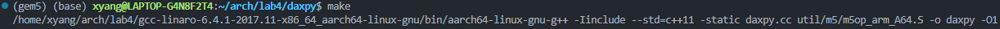

### 代码优化与正确性验证

#### 进行展开

```cpp
// Y = alpha * X + Y
void daxpy_unroll(double *X, double *Y, double alpha, const int N)
{
    int i = 0;
    // 循环展开，每次处理 4 个元素
    for (; i <= N - 4; i += 4)
    {
        Y[i] = alpha * X[i] + Y[i];
        Y[i + 1] = alpha * X[i + 1] + Y[i + 1];
        Y[i + 2] = alpha * X[i + 2] + Y[i + 2];
        Y[i + 3] = alpha * X[i + 3] + Y[i + 3];
    }
    // 处理剩余的元素
    for (; i < N; i++)
    {
        Y[i] = alpha * X[i] + Y[i];
    }
}

// Y = alpha * X^2 + beta * X + X * Y
void daxsbxpxy_unroll(double *X, double *Y, double alpha, double beta, const int N)
{
    int i = 0;
    // 循环展开，每次处理 4 个元素
    for (; i <= N - 4; i += 4)
    {
        Y[i] = alpha * X[i] * X[i] + beta * X[i] + X[i] * Y[i];
        Y[i + 1] = alpha * X[i + 1] * X[i + 1] + beta * X[i + 1] + X[i + 1] * Y[i + 1];
        Y[i + 2] = alpha * X[i + 2] * X[i + 2] + beta * X[i + 2] + X[i + 2] * Y[i + 2];
        Y[i + 3] = alpha * X[i + 3] * X[i + 3] + beta * X[i + 3] + X[i + 3] * Y[i + 3];
    }
    // 处理剩余的元素
    for (; i < N; i++)
    {
        Y[i] = alpha * X[i] * X[i] + beta * X[i] + X[i] * Y[i];
    }
}

// 一维模板操作 Y[i] = alpha * Y[i-1] + Y[i] + alpha * Y[i+1]
void stencil_unroll(double *Y, double alpha, const int N)
{
    int i = 1;
    // 循环展开，每次处理 4 个元素
    for (; i <= N - 5; i += 4)
    {
        Y[i] = alpha * Y[i - 1] + Y[i] + alpha * Y[i + 1];
        Y[i + 1] = alpha * Y[i] + Y[i + 1] + alpha * Y[i + 2];
        Y[i + 2] = alpha * Y[i + 1] + Y[i + 2] + alpha * Y[i + 3];
        Y[i + 3] = alpha * Y[i + 2] + Y[i + 3] + alpha * Y[i + 4];
    }
    // 处理剩余的元素
    for (; i < N - 1; i++)
    {
        Y[i] = alpha * Y[i - 1] + Y[i] + alpha * Y[i + 1];
    }
}
```

#### 正确性分析与优化效果

**正确性分析**：分别使用全未展开和展开后的源代码进行编译，并使用以下命令进行仿真：

```bash
build/ARM/gem5.opt configs/example/arm/starter_se.py ../lab4/daxpy/daxpy --cpu=hpi
```

得到的结果相同，即输出的数组和相同：

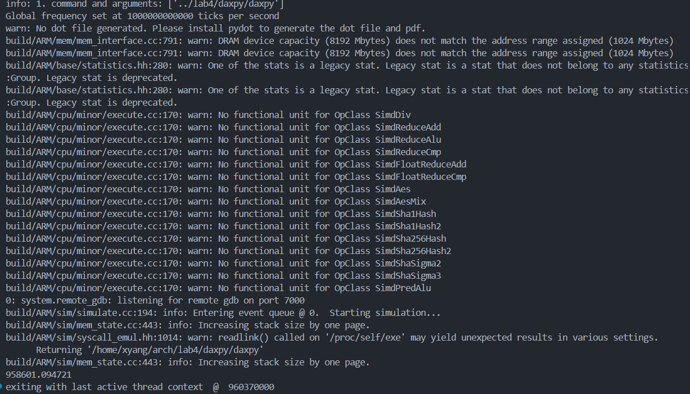

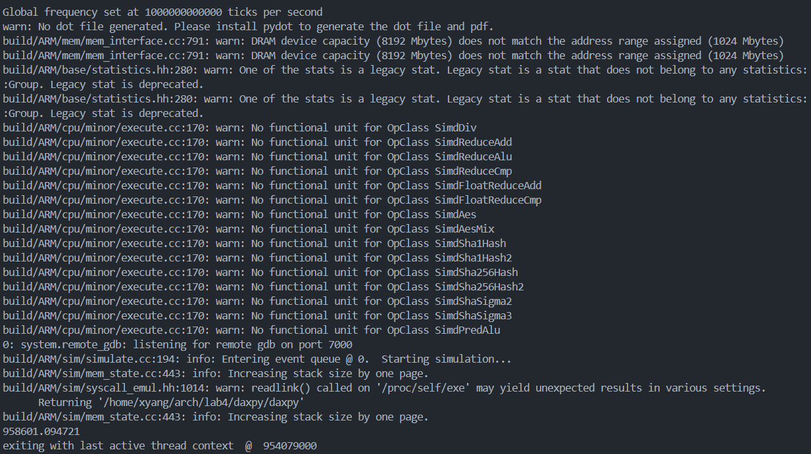

得到的 `stats.txt` 中，可以看到 `---------- Begin Simulation Statistics ----------` 有 8 个，中间六个对应了六个函数的统计信息

**结果分析**：可以看到对降低 `CPI` 的效果并不理想，但指令数普遍降低

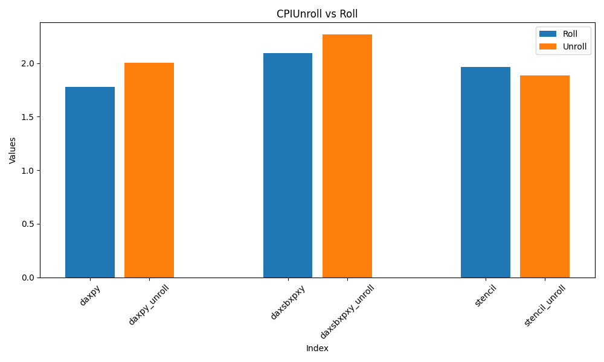

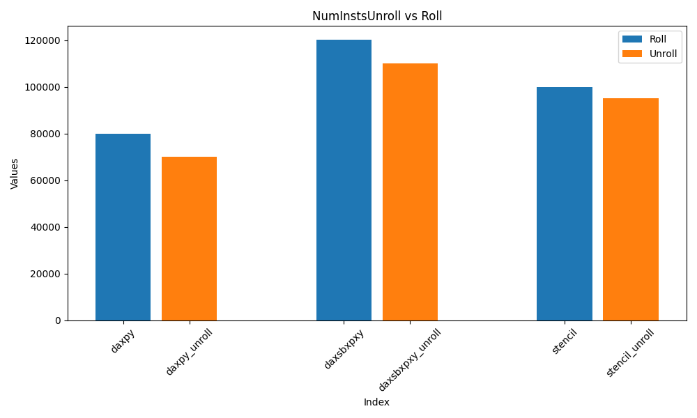

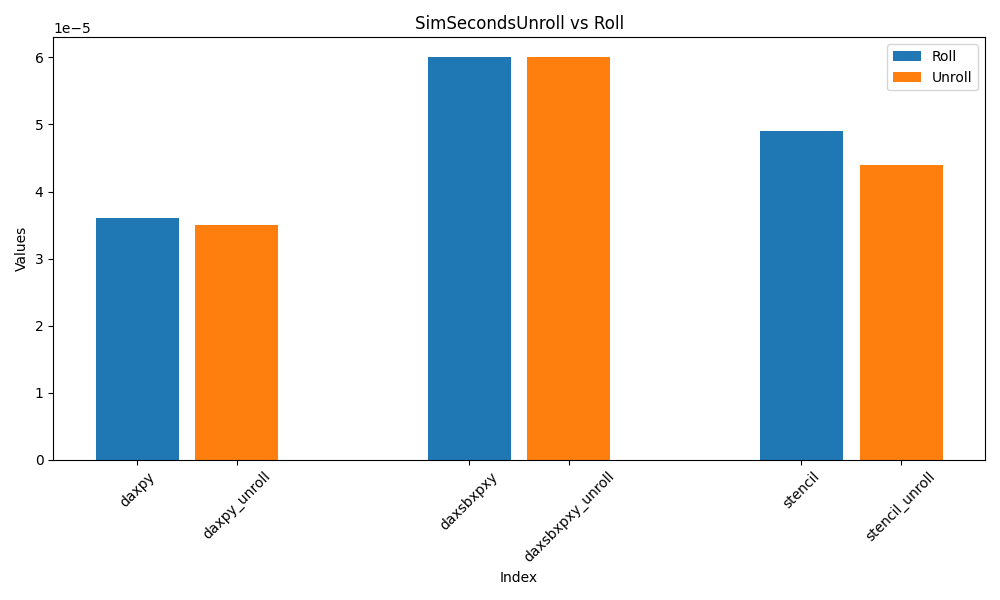

可以看到由于循环展开，减少了循环控制相关的指令数，但由于展开后的循环体中多个计算指令中仍存在数据依赖，`CPI` 甚至会升高；但综合下来，运行时间或有下降或保持不变

以下是一个表格，比较 `roll` 和 `unroll` 两种情况下的 `CPI`、`numInsts` 和 `simSeconds`：

| 指标         | daxpy         | daxpy_unroll | daxsbxpxy  | daxsbxpxy_unroll   | stencil | stencil_unroll |
|--------------|--------------|--------------|-----|----|----|---|
| **CPI**      | 1.777739     | 2.004756 | 2.013156 | 2.186898 | 1.962359 | 1.859714 |
| **numInsts** | 80014      | 70015 | 120017 | 110017 | 99997 | 95006 |
| **simSeconds** | 3.6e-05    | 3.5e-05 | 6e-05 | 6e-05 |  4.9e-05 | 4.4e-05 |

可以看到对于不同函数的优化效果不同，对于 `daxpy` 和 `daxsbxpxy` 来说，`CPI` 有所上升，同时指令数有所下降，对于 `daxsbxpxy` 来说总体运行时间保持不变；对于 `stencil` 来说，`CPI` 和指令数都有所降低，`simSeconds` 下降最为明显

#### 循环展开分析

1. **展开解决的hazard**

在原本未展开的循环里，每次迭代通常要依赖上一次迭代的结果，或者连续读写数组元素（比如 Y[i]，Y[i-1]，Y[i+1]），如果处理器流水线过深，就会因为等待前一条指令完成写回导致 流水线停顿（Pipeline Stall）。

通过循环展开（Loop Unrolling），可以让连续的指令间互不依赖，处理器就能更好地并行执行（比如超标量（Superscalar）处理器可以同时执行多条指令），减少流水线阻塞，提高指令吞吐率。即**主要减少了 数据相关性（Data Hazard） 中的 读后写（Read After Write, RAW）hazard**

2. **展开次数的影响**

**展开不够**：
流水线停顿仍然存在，无法隐藏指令延迟；指令并行度（ILP）不够高，处理器资源（执行单元）利用率低；程序性能提升有限。

**展开太多**：指令缓存压力（Instruction Cache Pressure）增加，程序代码体积变大；寄存器压力（Register Pressure）增加，可能导致寄存器溢出（spill到内存），反而增加访存延迟；分支预测失误风险上升，尤其是循环收尾处理复杂；可维护性降低，代码结构更复杂

- 展开两次
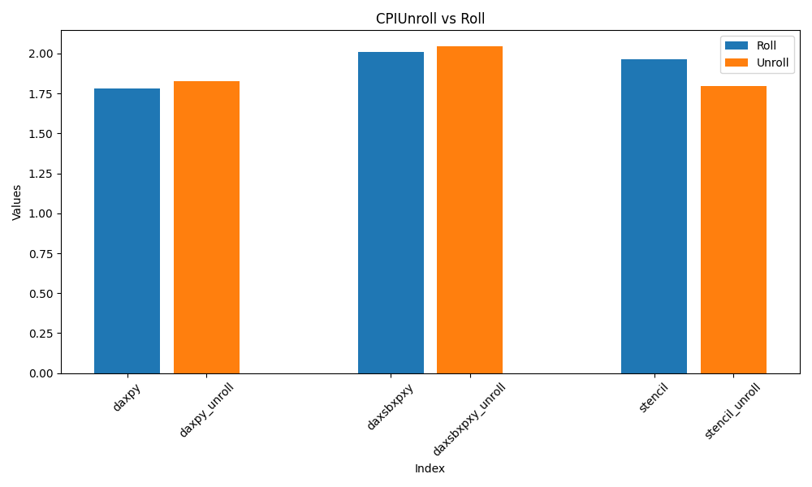
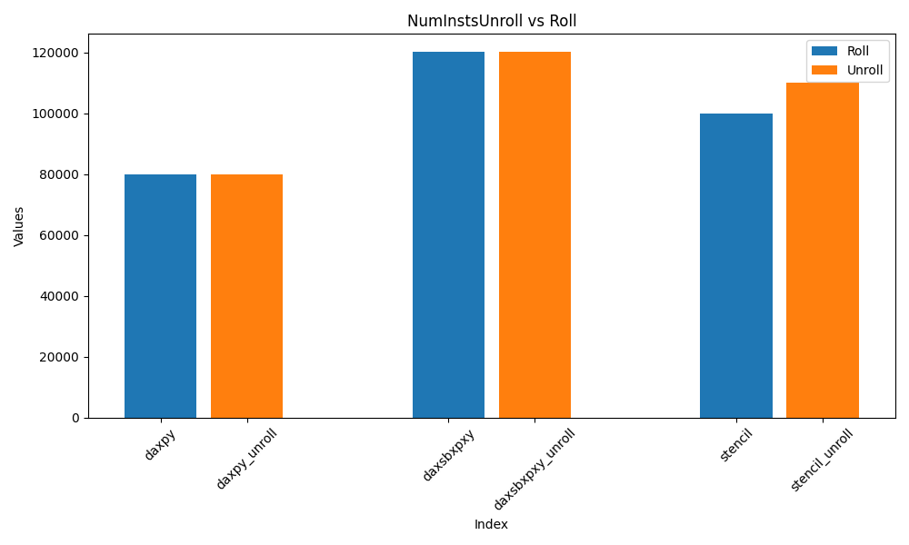
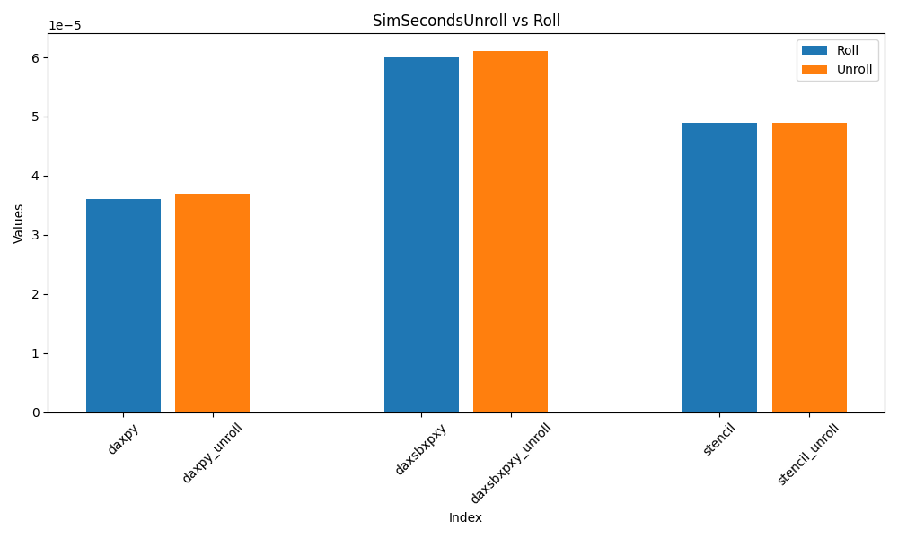

```bash
CPI Values:
CPI_1: 1.781251
CPI_2: 1.825377
CPI_3: 2.01084
CPI_4: 2.042968
CPI_5: 1.962369
CPI_6: 1.798478

NumInsts Values:
NumInsts_1: 80014
NumInsts_2: 80018
NumInsts_3: 120017
NumInsts_4: 120020
NumInsts_5: 99997
NumInsts_6: 109998

SimSeconds Values:
SimSeconds_1: 3.6e-05
SimSeconds_2: 3.7e-05
SimSeconds_3: 6e-05
SimSeconds_4: 6.1e-05
SimSeconds_5: 4.9e-05
SimSeconds_6: 4.9e-05
```

- 展开八次
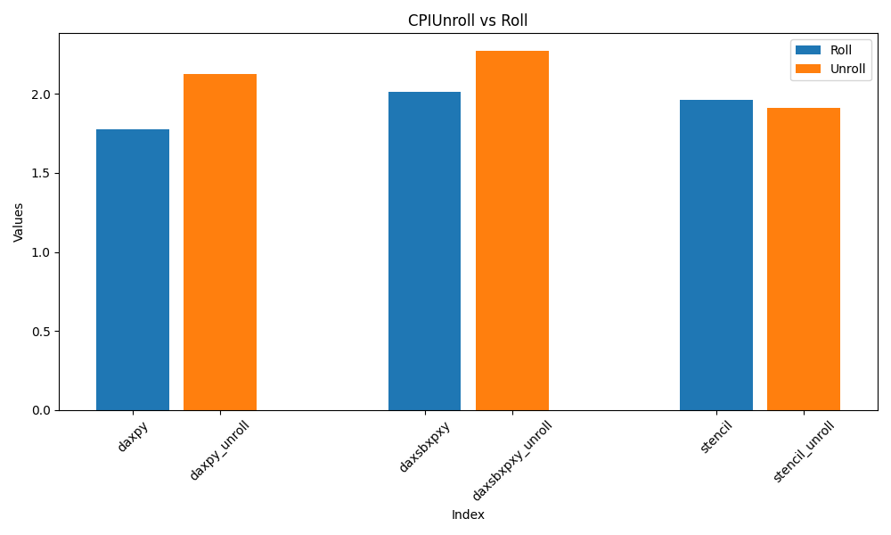
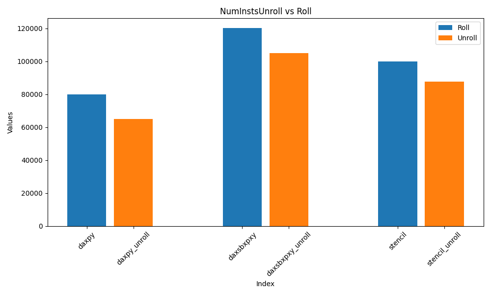
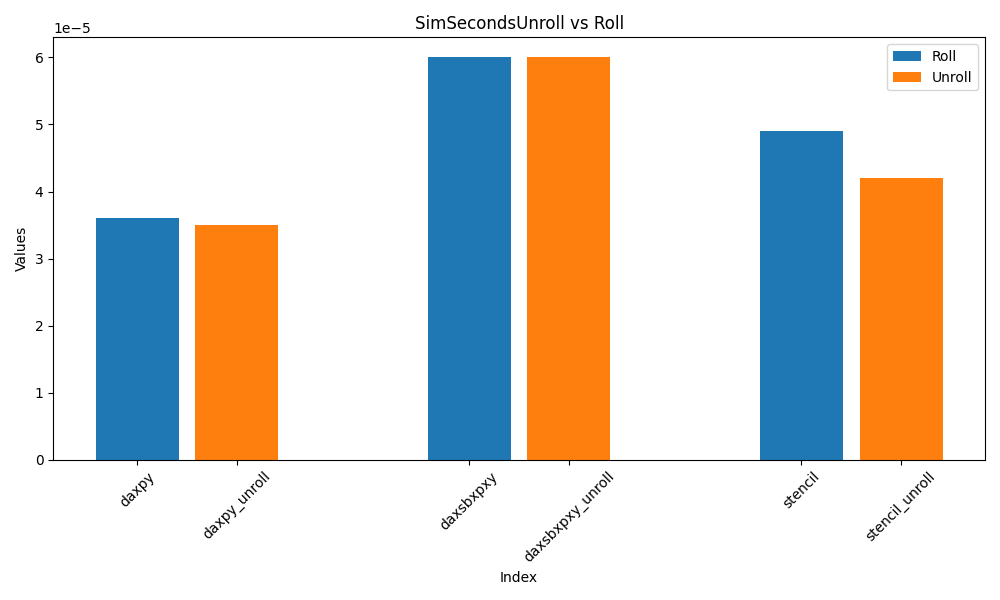

```bash
CPI Values:
CPI_1: 1.777839
CPI_2: 2.126709
CPI_3: 2.013106
CPI_4: 2.270423
CPI_5: 1.962279
CPI_6: 1.909923

NumInsts Values:
NumInsts_1: 80014
NumInsts_2: 65015
NumInsts_3: 120017
NumInsts_4: 105017
NumInsts_5: 99997
NumInsts_6: 87514

SimSeconds Values:
SimSeconds_1: 3.6e-05
SimSeconds_2: 3.5e-05
SimSeconds_3: 6e-05
SimSeconds_4: 6e-05
SimSeconds_5: 4.9e-05
SimSeconds_6: 4.2e-05
```

展开八次总的运行时间与展开四次类似，但 `CPI` 相较来说更高，`numInsts` 更少，对于 `stencil` 的总时间优化更明显，但前两个函数影响不大；

`stencil` 函数中 `Y[i] = alpha * Y[i-1] + Y[i] + alpha * Y[i+1];` 存在较大的数据依赖，尤其是未展开的情况下，`Y[i-1]` 可能造成较大的 hazard，因此使用手动循环展开的效果也最好

### 添加浮点运算单元

| 增加3个FPU/SMID单元 | 原函数影响 | 循环展开优化版影响 |
| --- | --- | --- |
| 对结构冒险的影响 | 减少 | 大幅减少 |
| 对数据冒险的影响 | 降低数据冒险 | 展开后减少数据相关性，进一步提升 |
| 对控制冒险的影响 | 无明显变化 | 无明显变化 |

**增加硬件对于函数性能的影响**

|  函数/CPI         |  未添加FU/O1   |  添加FU/O1    |  未添加Fu/O3   | 添加FU/O3 |
| ----------------- | ------------  | ------------  | ------------  | --------- |
| daxpy             |  1.777764     | 1.777739      |   1.823947    | 1.823947  |
| daxpy_unroll      |  2.004756     | 2.004756      |   2.033501    | 1.995404  |
| daxsbxpxy         |  2.09647      | 2.013156      |   2.062701    | 2.062701  |
| daxsbxpxy_unroll  |  2.26635      | 2.186898      |   1.552187    | 1.539059  |
| stencil           |  1.962359     | 1.962359      |   2.239337    | 2.208287  |
| stencil_unroll    |  1.886007     | 1.859714      |   3.414568    | 3.201089  |

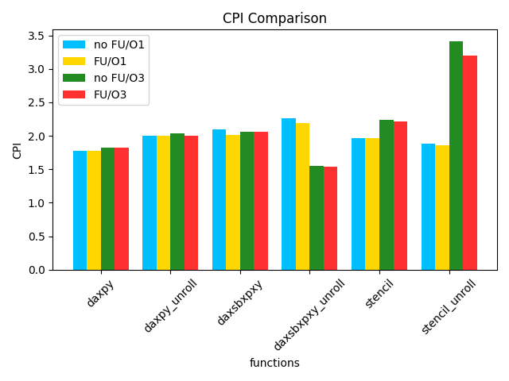

可以看到添加了 FU 后，CPI 均有所下降，但是手动展开后对于 CPI 的优化更明显，说明使用更适合的代码结构可以使流水线更充分发挥调度功能发挥硬件能力；
添加 FU 对于总的指令数并没有影响，因此 CPI 就可以反应添加 FU 对于整体性能的优化效果

### 使用O3编译优化

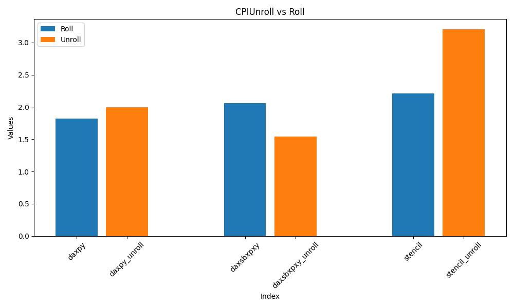
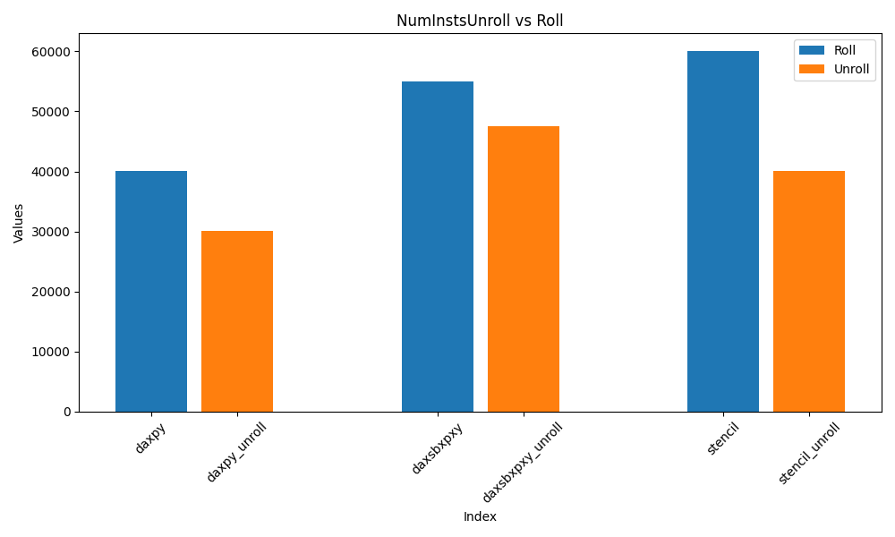
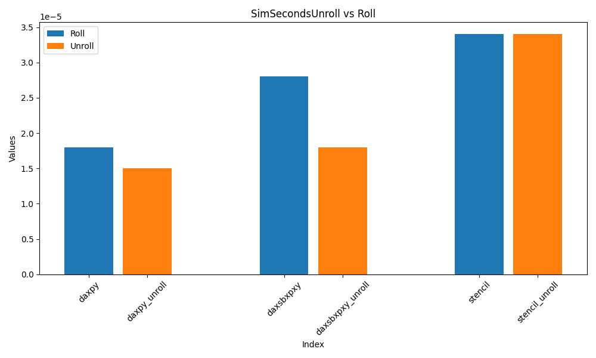

```bash
CPI Values:
CPI_1: 1.823947
CPI_2: 2.033501
CPI_3: 2.062701
CPI_4: 1.552187
CPI_5: 2.239337
CPI_6: 3.414568

NumInsts Values:
NumInsts_1: 40022
NumInsts_2: 30029
NumInsts_3: 55023
NumInsts_4: 47531
NumInsts_5: 59999
NumInsts_6: 40032

SimSeconds Values:
SimSeconds_1: 1.8e-05
SimSeconds_2: 1.5e-05
SimSeconds_3: 2.8e-05
SimSeconds_4: 1.8e-05
SimSeconds_5: 3.4e-05
SimSeconds_6: 3.4e-05
```

- **性能指标**：综合考虑下，使用运行时间 `SimSeconds` 最能反应整体的性能；`CPI` 可能由于优化手段新引入的相关性降低，但又是 `numInsts` 的降低占主要影响部分；综合考虑下，使用 `SimSeconds` 是最能体现出优化后的整体性能变化的指标

可以看到对前两个函数的优化效果很好，但对于 `stencil` 虽然整体时间降低了，但是否做手动展开并不影响最后的总运行时间，使用手动展开的反而 `CPI` 较高

可以看到的是，使用 `O3` 后无论是是否手动循环展开，总的运行时间都大幅降低，但只有 `daxsbxpxy` 的 `CPI` 下降最为明显，并且经过手动展开的版本性能优化尤为明显

**因此，手动优化是有必要的，相较于未手动展开的版本，经过 `O3` 优化后，展开后的总的运行时间下降最为明显**
